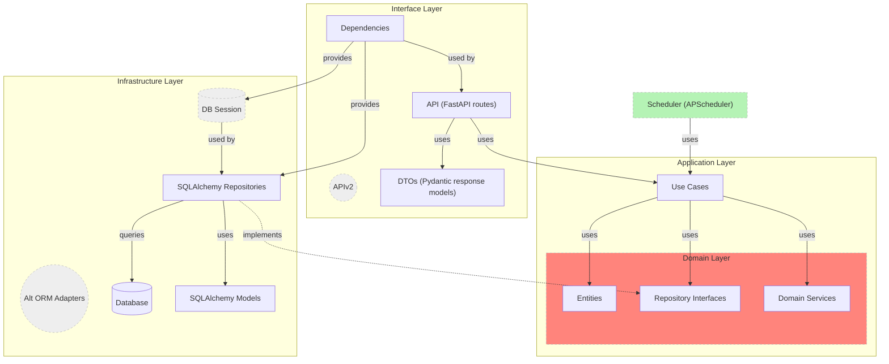
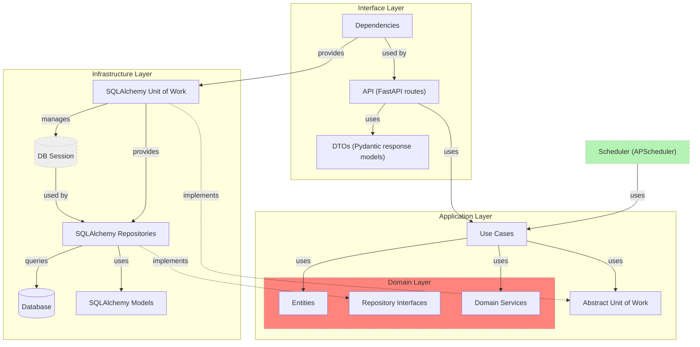
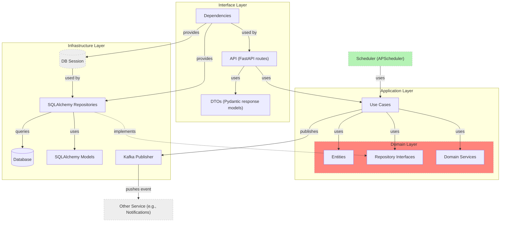

# Lottery Service

This is a backend service for managing lotteries. 
- allows users to submit ballots (register as lottery participants), 
- lotteries are closed automatically at midnight,
- users can check the winning ballot for any specific date.

## Architecture overview

> note: 
> - Arrows show dependency direction
> - Dashed arrows (– –>) indicate implementation of interfaces
> - Each context (user, lottery) is designed for independent evolution or extraction
> - Dotted border: Theoretical extension point
> - Red layer: Domain logic (core of the application)



> Right now `UseCase`s constructors receive a concrete `session`. This means that the **application layer** has indirect knowledge of the infrastructure layer, it is slightly mitigated by depending on the abstract interface, but is still a tight coupling that is planned to addressed by introducing UoW (See [ToDo section](#ToDo))

## Additional features

- Each day’s lottery can have multiple ballots
- A winner is randomly selected when the lottery closes via scheduler
- Users can be banned/unbanned
- Built-in swagger docs `/docs`
- PostgreSQL-backed persistence
- DDD structure with Clean Architecture adaptation
- Dockerized for easy setup
- The `/lotteries/close` route is protected to prevent unauthorized access


## Architecture Decisions

- Very explicit separation of concerns between domain, use cases, infrastructure (DB), and interface
- **Use Cases as Application Layer**: Business logic is encapsulated in dedicated UseCase classes for testability and clarity.
- **Repository Abstractions**: Domain depends only on repository interfaces, infrastructure provides the implementations.
- **Scheduler via APScheduler**: A simple cron job is registered to close the lottery every night. *See [ToDo](#ToDo) notes*
- Contexts are separated to allow easy decomposition into microservices, since lottery and user domains are typically maintained by separate teams and deployed as separate services

## Tradeoffs and Considerations

- Sync SQLAlchemy is simpler and sufficient here, but not optimal for high-concurrency workloads in production environments
- No Unit of Work: Repositories commit changes directly. In larger systems, a Unit of Work would manage transaction boundaries more clearly.
- Public create & submit: Anyone can create or submit ballots. Access control is out of scope for this task, as well as any user registration.

## Testing

Basic unit tests for domain entities and one use case are included as an example

**TBD**: Add full test coverage

## Development Guide

### Quick Start

```bash
$ git clone https://github.com/gokadi/lottery.git
$ cd lottery
```

#### Start DB and API

```bash
$ docker compose up --build
```

### Migrations

#### Generate (requires DB running)

```bash
$ docker compose run web alembic revision --autogenerate -m "initial"
```

#### Apply

```bash
$ docker compose run web alembic upgrade head
```

## Run Scheduler

The APScheduler task is started automatically with the app. It runs every day at 00:00 UTC.

Manual lottery closing:

```bash
$ curl -X POST "localhost:8000/lotteries/close?date=2025-05-08" \
     -H "X-Internal-Token: $INTERNAL_CLOSE_TOKEN"
```

Requires `INTERNAL_CLOSE_TOKEN` set in environment.

# ToDo

These are things I'd like to add/modify but didn't have time for or things that need to be changed to make solution production-ready:

- Provide self-descriptive domain exceptions
- Cover the remaining code with tests
- Switch to async SQLAlchemy for better concurrency
- Add pagination to ballot queries
- Introduce UnitOfWork abstraction to manage transactions:
> **_NOTE:_**  `AbstractUoW` to be defined on application layer, make UseCases depend on abstraction, and pass implementation of `UoW` in corresponding `dependencies.py` (use of repositories in use cases are implemented this way). This will fully decouple infra and interface layers, but for now looks like an overengineering.


# Late future features

- Event publishing
> note: Would be useful to emit a `LotteryClosed` event to a bus to allow external microservice (e.g., `notifications` service) react
> simplified (not following layering, w/o abstractions etc.) diagram:


- Add proper auth for user-related actions (JWT, sessions, etc.) & user roles
- Consider event driven architecture (might be a better fit for lottery platform due to high demand in auditing)
- Partition data per month/year based on expected load
- Set ETL job to archive very old data (to aws glacier or athena + bucket storage)
